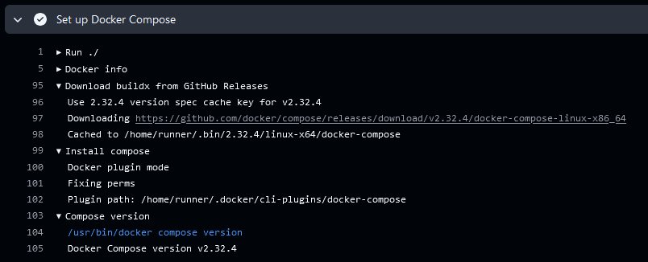

[](https://docs.stepsecurity.io/actions/stepsecurity-maintained-actions)

[](https://github.com/step-security/setup-compose-action/releases/latest)
[](https://github.com/step-security/setup-compose-action/actions?workflow=ci)
[](https://github.com/step-security/setup-compose-action/actions?workflow=test)

## About

GitHub Action to set up Docker [Compose](https://github.com/docker/compose).



___

* [Usage](#usage)
* [Customizing](#customizing)
  * [inputs](#inputs)

## Usage

```yaml
name: ci

on:
  push:

jobs:
  compose:
    runs-on: ubuntu-latest
    steps:
      -
        name: Set up Docker Compose
        uses: step-security/setup-compose-action@v2
```

> [!NOTE]
> If Docker Compose is already installed on the runner, the action will skip
> download. Otherwise, it will download and install the latest stable version
> [available on GitHub](https://github.com/docker/compose/releases/latest).

To always download and install the latest version of Docker Compose:

```yaml
      -
        name: Set up Docker Compose
        uses: step-security/setup-compose-action@v2
        with:
          version: latest
```

## Customizing

### inputs

The following inputs can be used as `step.with` keys:

| Name           | Type   | Default | Description                                                                     |
|----------------|--------|---------|---------------------------------------------------------------------------------|
| `version`      | String |         | [Compose](https://github.com/docker/compose) version. (eg. `v2.32.4`, `latest`) |
| `cache-binary` | Bool   | `true`  | Cache compose binary to GitHub Actions cache backend                            |

